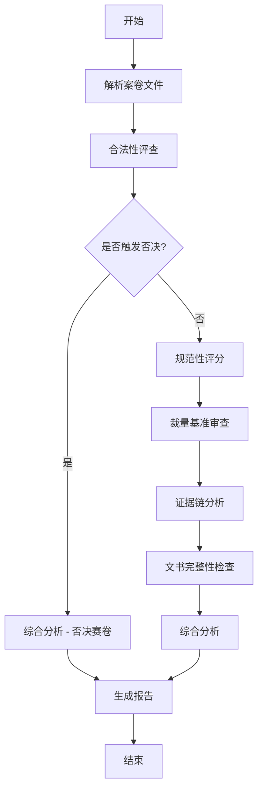

# 多智能体协作系统设计文档

## 概述

本系统采用多智能体协作架构，由6个专业智能体协同工作，完成生态环境行政处罚案卷的全面评查。

---

## 智能体架构

### 整体架构图

```
┌─────────────────────────────────────────────────────────────────┐
│                      用户请求层                                 │
│         CLI / API / 飞书 / 钉钉 / Telegram                      │
└─────────────────────────────────────────────────────────────────┘
                              │
                              ▼
┌─────────────────────────────────────────────────────────────────┐
│                   任务调度器 (Task Scheduler)                    │
│              负责任务分发、流程编排、结果汇总                     │
└─────────────────────────────────────────────────────────────────┘
                              │
           ┌──────────────────┼──────────────────┐
           ▼                  ▼                  ▼
┌─────────────────┐  ┌─────────────────┐  ┌─────────────────┐
│   智能体1       │  │   智能体2       │  │   智能体3       │
│  合法性评查     │  │  规范性评分     │  │  裁量基准计算   │
│  Agent         │  │  Agent         │  │  Agent         │
└─────────────────┘  └─────────────────┘  └─────────────────┘
           │                  │                  │
           └──────────────────┼──────────────────┘
                              ▼
┌─────────────────────────────────────────────────────────────────┐
│                   共享知识库 (Shared Knowledge Base)              │
│    存储评查标准、历史案例、学习经验、用户偏好                      │
└─────────────────────────────────────────────────────────────────┘
                              │
           ┌──────────────────┼──────────────────┐
           ▼                  ▼                  ▼
┌─────────────────┐  ┌─────────────────┐  ┌─────────────────┐
│   智能体4       │  │   智能体5       │  │   智能体6       │
│  证据链分析     │  │  文书完整性检查  │  │  综合分析报告   │
│  Agent         │  │  Agent         │  │  Agent         │
└─────────────────┘  └─────────────────┘  └─────────────────┘
                              │
                              ▼
┌─────────────────────────────────────────────────────────────────┐
│                      结果输出层                                  │
│              报告生成、消息通知、API响应                          │
└─────────────────────────────────────────────────────────────────┘
```

### 智能体职责分工

| 智能体编号 | 名称 | 职责 | 输入 | 输出 |
|-----------|------|------|------|------|
| 1 | 合法性评查智能体 | 检查25项一票否决条件 | 案卷内容 | 是否否决、否决项列表、合法性得分 |
| 2 | 规范性评分智能体 | 文书评分、卷面要素评分 | 案卷内容 | 文书得分、基本要素扣分、规范性得分 |
| 3 | 裁量基准智能体 | 罚款金额计算验证 | 违法类型、案件数据 | 计算金额、合理性评估 |
| 4 | 证据链智能体 | 证据三性分析 | 案卷内容 | 完整度、合法性、关联性、客观性 |
| 5 | 文书完整性智能体 | 检查14项文书是否齐全 | 案卷内容 | 缺失文书列表、完整度 |
| 6 | 综合分析智能体 | 汇总评分、生成报告 | 各模块结果 | 综合得分、等级、评查报告 |

---

## 工作流程

### 完整评查流程



### 流程说明

#### 阶段一：文件解析
1. 接收案卷文件（PDF/TXT/JSON）
2. 提取文本内容
3. 识别关键信息（案号、当事人、违法类型等）
4. 准备评查数据

#### 阶段二：合法性评查（一票否决）
1. 检查25项否决条件
2. 识别问题并记录法律依据
3. 输出合法性得分（0或50分）
4. **若触发否决，直接进入综合分析阶段**

#### 阶段三：规范性评分（并行）
1. 检查卷面基本要素（20分）
2. 评分14项文书（100分→折算50分）
3. 计算规范性得分

#### 阶段四：裁量基准审查（并行）
1. 根据违法类型选择裁量基准表
2. 分析裁量因素（超标倍数、改正情况、主观过错等）
3. 计算应处罚金额
4. 比对案卷记载金额，评估合理性

#### 阶段五：证据链分析（并行）
1. 检测证据类型完整性
2. 评估证据合法性、关联性、客观性
3. 识别证据链问题

#### 阶段六：文书完整性检查（并行）
1. 检查14项必需文书是否齐全
2. 计算文书完整度

#### 阶段七：综合分析
1. 汇总各模块结果
2. 计算综合得分
3. 判定等级
4. 生成评查报告

---

## 智能体通信协议

### 消息格式

```json
{
  "task_id": "unique-task-id",
  "agent_id": "legality_review",
  "message_type": "request|response|error",
  "content": {
    "case_id": "case-001",
    "case_data": {...},
    "parameters": {...}
  },
  "timestamp": "2024-01-01T12:00:00Z",
  "status": "pending|processing|completed|failed"
}
```

### 数据共享机制

| 共享数据 | 存储位置 | 用途 |
|---------|---------|------|
| 评查标准 | JSON 文件 | 各智能体评分依据 |
| 历史案例 | Redis/数据库 | 学习参考、案例比对 |
| 用户偏好 | Redis | 个性化设置 |
| 临时结果 | Redis | 跨智能体传递 |

---

## HERMES 技能配置

### 技能清单

```yaml
skills:
  - name: legality_review
    description: 合法性评查
    path: ./skills/legality_review.yaml
  
  - name: normative_scoring
    description: 规范性评分
    path: ./skills/normative_scoring.yaml
  
  - name: discretion_calculation
    description: 裁量基准计算
    path: ./skills/discretion_calculation.yaml
  
  - name: evidence_chain
    description: 证据链分析
    path: ./skills/evidence_chain.yaml
  
  - name: document_completeness
    description: 文书完整性检查
    path: ./skills/document_completeness.yaml
  
  - name: comprehensive_analysis
    description: 综合分析报告
    path: ./skills/comprehensive_analysis.yaml
```

### 工作流配置

```yaml
name: full_case_review_workflow
description: 完整案卷评查工作流

steps:
  # 步骤1：解析文件
  - id: parse
    use: document_parser
    inputs:
      file: "${case_file}"
  
  # 步骤2：合法性评查（一票否决）
  - id: legality
    use: legality_review
    inputs:
      content: "${parse.output.content}"
      case_type: "${parse.output.case_type}"
  
  # 步骤3：条件分支 - 未否决继续
  - id: branch
    type: conditional
    condition: "${legality.output.has_veto == false}"
    if_true:
      # 步骤3a：规范性评分
      - id: normative
        use: normative_scoring
        inputs:
          content: "${parse.output.content}"
      
      # 步骤3b：裁量基准计算
      - id: discretion
        use: discretion_calculation
        inputs:
          violation_type: "${parse.output.violation_type}"
          case_data: "${parse.output}"
      
      # 步骤3c：证据链分析
      - id: evidence
        use: evidence_chain
        inputs:
          content: "${parse.output.content}"
      
      # 步骤3d：文书完整性检查
      - id: documents
        use: document_completeness
        inputs:
          content: "${parse.output.content}"
  
  # 步骤4：综合分析
  - id: comprehensive
    use: comprehensive_analysis
    inputs:
      legality_result: "${legality.output}"
      normative_result: "${normative.output || {}}"
      discretion_result: "${discretion.output || {}}"
      evidence_result: "${evidence.output || {}}"
      documents_result: "${documents.output || {}}"
  
  # 步骤5：生成报告
  - id: report
    use: report_generator
    inputs:
      result: "${comprehensive.output}"
      format: "markdown"
```

---

## 智能体协作模式

### 1. 流水线模式

```
输入 → 智能体1 → 智能体2 → 智能体3 → ... → 输出
```

**适用场景**：需要严格顺序执行的任务

### 2. 并行模式

```
输入 → [智能体1, 智能体2, 智能体3] → 汇总 → 输出
```

**适用场景**：各智能体独立工作，结果汇总

### 3. 条件分支模式

```
输入 → 智能体1 → {条件判断} → [智能体2a 或 智能体2b] → 输出
```

**适用场景**：根据中间结果选择不同路径

### 4. 循环迭代模式

```
输入 → 智能体 → {条件判断} → [继续迭代 或 结束]
```

**适用场景**：需要多次迭代优化的任务

---

## 自我学习机制

### 学习流程

```
┌──────────────────────────────────────────────────────────────┐
│                      学习循环                                 │
├──────────────────────────────────────────────────────────────┤
│  执行评查 → 收集数据 → 分析模式 → 沉淀技能 → 更新知识库         │
└──────────────────────────────────────────────────────────────┘
```

### 学习内容

| 学习类型 | 描述 | 存储位置 |
|---------|------|---------|
| 问题模式 | 常见问题类型和处理方式 | 知识库 |
| 评分经验 | 评分标准的实际应用经验 | 知识库 |
| 用户偏好 | 用户的评查偏好设置 | 用户画像 |
| 案例库 | 历史评查案例 | 案例库 |

### 技能沉淀机制

每次评查完成后，系统自动：
1. 检查是否发现新的问题模式
2. 询问用户是否保存为可复用技能
3. 更新技能库
4. 下次评查时直接调用

---

## 部署架构

### 本地部署（开发/测试）

```
单进程运行，所有智能体在同一进程内协作
```

### 容器部署（生产）

```yaml
# docker-compose.yml
services:
  case-review:
    image: hermes-case-review:latest
    environment:
      - REDIS_URL=redis://redis:6379
    depends_on:
      - redis
  
  redis:
    image: redis:latest
```

### 分布式部署（大规模）

```
┌─────────────────┐      ┌─────────────────┐
│   API Gateway   │      │  Message Queue  │
└────────┬────────┘      └────────┬────────┘
         │                        │
    ┌────┴────┐              ┌────┴────┐
    ▼         ▼              ▼         ▼
┌───────┐ ┌───────┐    ┌───────┐ ┌───────┐
│Agent1 │ │Agent2 │    │Agent3 │ │Agent4 │
└───────┘ └───────┘    └───────┘ └───────┘
```

---

## 监控与日志

### 监控指标

| 指标 | 说明 | 采集频率 |
|------|------|---------|
| 评查耗时 | 单次评查总耗时 | 每次 |
| 智能体耗时 | 各智能体执行耗时 | 每次 |
| 成功率 | 评查成功比例 | 每分钟 |
| 否决率 | 触发否决的比例 | 每分钟 |
| 错误率 | 错误发生比例 | 每分钟 |

### 日志结构

```json
{
  "timestamp": "2024-01-01T12:00:00Z",
  "level": "INFO",
  "task_id": "task-001",
  "agent_id": "legality_review",
  "message": "评查完成",
  "data": {
    "case_id": "case-001",
    "has_veto": false,
    "score": 50
  }
}
```

---

## 安全性

### 数据安全

- 案卷数据加密存储
- 传输使用 HTTPS
- 敏感信息脱敏处理

### 访问控制

- RBAC 权限管理
- API Key 认证
- 操作审计日志

### 合规性

- 符合政务数据安全要求
- 完全自托管部署
- 数据不出门

---

## 总结

多智能体协作系统通过以下方式提升评查效率：

1. **专业化分工** - 每个智能体专注于特定领域
2. **并行执行** - 可并行的任务同时进行
3. **知识共享** - 统一知识库支撑所有智能体
4. **自我学习** - 从实践中不断优化
5. **灵活扩展** - 易于添加新的智能体

这种架构为系统的持续进化奠定了坚实基础。
